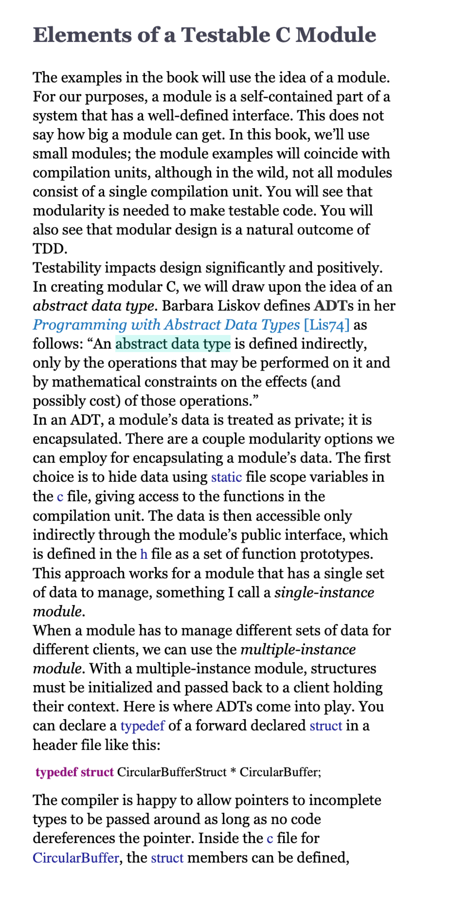
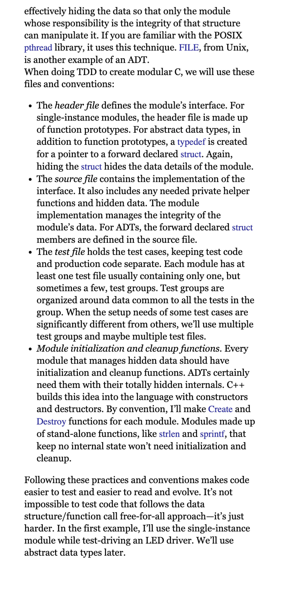

# Abstract Data Types

This as an example showing the usage of an abstract data type

See in main.c how accessing field of the struct is not possible
    
    int i = circularBuffer1->capacity
     
and thus is an encapsulation the state of CircularBuffer in  CircularBuffer.c

##  Chapter from Test Driven Development for Embedded C – James W. Grenning:

